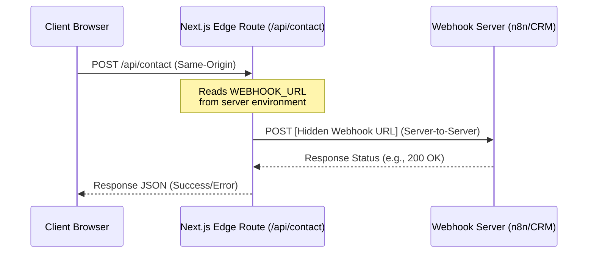

# Reach Smart — Webhook Setup Guide

This document explains how to configure the contact form submission pipeline for the Reach Smart bilingual website.

To prevent CORS issues and protect your webhook endpoints, the project uses a **Serverless Proxy Pattern**. Instead of posting form data directly to your n8n, CRM, or email webhook from the user's browser, the frontend calls the local Next.js Edge route `/api/contact`, which proxies the payload server-side to your webhook URL.

---

## Architecture Diagram



---

## 1. Local Development Setup

In local development, Next.js automatically loads environment variables from a `.env.local` file.

### Step 1: Create your `.env.local` file

Create a new file in the root of the project named `.env.local` (this file is git-ignored by default):

```env
WEBHOOK_URL=https://your-n8n-instance.example.com/webhook/contact
```

> [!IMPORTANT]
> The environment variable is named `WEBHOOK_URL` **without** the `NEXT_PUBLIC_` prefix. This is intentional. Next.js only exposes variables starting with `NEXT_PUBLIC_` to the client browser. By omitting this prefix, the webhook URL remains securely hidden on the server/edge.

### Step 2: Run the Development Server

Next.js automatically loads `.env.local` when starting:

```bash
npm run dev
```

The app will handle forwarding form data to the endpoint specified in your local variable.

---

## 2. Deployed Production Setup

Because the API route uses Next.js App Router, it is fully compiled and deployed automatically on Vercel, Netlify, and Cloudflare Pages.

### Option A: Deploying to Vercel (Native)

Vercel is the native home for Next.js, meaning no additional adapters or configurations are required.

1. **Deploy Your Repository**: Connect your project repository to Vercel.
2. **Configure the Environment Variable**:
   - Go to your project dashboard on Vercel.
   - Navigate to **Settings** → **Environment Variables**.
   - Add a new variable:
     * **Key:** `WEBHOOK_URL`
     * **Value:** `https://your-n8n-instance.example.com/webhook/contact`
     * **Target:** Select `Production`, `Preview`, and `Development`.
3. **Save and Deploy**: Click **Save**. If the project was already deployed, trigger a new deployment to inject the variable.

---

### Option B: Deploying to Netlify

Netlify automatically detects and compiles Next.js App Router projects using the Netlify Next.js runtime.

1. **Configure Environment Variables**:
   - Go to your Netlify dashboard and select your site.
   - Navigate to **Site settings** → **Build & deploy** → **Environment** → **Environment variables**.
   - Click **Add a variable** → **Add single variable**:
     * **Key:** `WEBHOOK_URL`
     * **Value:** `https://your-n8n-instance.example.com/webhook/contact`
   - Click **Create variable**.
2. **Trigger a Deploy**: If you have a live deploy, trigger a new build from the Netlify dashboard to inject the variable.

---

### Option C: Deploying to Cloudflare Pages

To deploy Next.js on Cloudflare Pages, we utilize the `@cloudflare/next-on-pages` CLI to compile Next.js into a compatible Cloudflare Pages Functions package running on Cloudflare Workers.

#### Step 1: Install the Cloudflare Next.js Adapter

Install the adapter and CLI packages as devDependencies:

```bash
npm install --save-dev @cloudflare/next-on-pages
```

> [!NOTE]
> Cloudflare and Next.js now also support **OpenNext** as a modern adapter alternative for deploying Next.js on Cloudflare Pages. Both options compile the App Router endpoints successfully. If using OpenNext, refer to [opennext.js.org/cloudflare](https://opennext.js.org/cloudflare) for building.

#### Step 2: Configure the Edge Runtime

We have configured the API route to run on the **Edge Runtime**, which is required for Cloudflare Workers compatibility. Inside [route.js](file:///c:/Users/haren/Documents/Antigravity%20coding/The%20Reach%20Smart/src/app/api/contact/route.js), the runtime export statement is defined:

```javascript
export const runtime = "edge";
```

#### Step 3: Run the Cloudflare Build Command

To build the project for Cloudflare Pages, run the compiler:

```bash
npx @cloudflare/next-on-pages
```

This generates a `.cardinal` or `.vercel/output/static` and `.cloudflare` directory structured for Cloudflare's serverless system.

#### Step 4: Configure the Environment Variable on Cloudflare Dashboard

1. Log into your Cloudflare Dashboard and navigate to **Workers & Pages** → **Pages**.
2. Select your Pages project.
3. Go to **Settings** → **Environment variables**.
4. In the **Production** environment section, click **Add variables**:
   - **Variable name:** `WEBHOOK_URL`
   - **Value:** `https://your-n8n-instance.example.com/webhook/contact`
5. Repeat for the **Preview** environment if you want to test forms in preview deployments.
6. Click **Save**.
7. **Redeploy**: Go to the **Deployments** tab and redeploy the latest build to apply the variable.

---

## 3. Benefits of this Pattern

1. **Zero CORS Issues**: The browser submits data to the same origin (`/api/contact`). Same-origin requests bypass CORS checks entirely.
2. **Hidden Endpoint**: The secret webhook endpoint is kept safe inside server environment variables, protecting it from spam or malicious script inspection.
3. **Optimized Edge Performance**: The proxy route is built on the Next.js Edge Runtime, meaning requests are handled close to the user with minimal latency.

---

## 4. File Reference

| File | Purpose |
| :--- | :--- |
| [route.js](file:///c:/Users/haren/Documents/Antigravity%20coding/The%20Reach%20Smart/src/app/api/contact/route.js) | Next.js Edge API proxy route. Forwards submissions server-side. |
| [page.js](file:///c:/Users/haren/Documents/Antigravity%20coding/The%20Reach%20Smart/src/app/page.js) | Main React page component. Captures client inputs and dispatches to `/api/contact`. |
| [copy.js](file:///c:/Users/haren/Documents/Antigravity%20coding/The%20Reach%20Smart/src/app/copy.js) | Stores translations, status text, and validation labels. |
| [layout.js](file:///c:/Users/haren/Documents/Antigravity%20coding/The%20Reach%20Smart/src/app/layout.js) | Configures fonts and base HTML setup. |
| `.env.local` | Local environment variables containing the target webhook url (git-ignored). |
