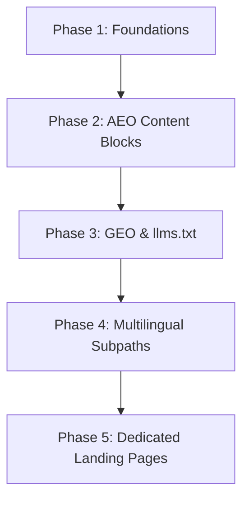

# The Reach Smart — SEO, AEO, & GEO Complete Optimization Plan

> **Goal:** Position **The Reach Smart** as the dominant authority for AI automations in SaaS and e-commerce across traditional search engines (Google, Bing), AI answer engines (ChatGPT, Perplexity, Claude, Gemini, SearchGPT), and generative search platforms.
>
> **Scope:** Architecture, Content, Schema, Technical SEO, AI Crawler Accessibility, and Multilingual Optimization (EN, BG, FR).

---

## Executive Summary: The 3 Pillars of Modern Search

| Pillar | Focus | Key Targets | Primary Optimization Strategy |
|---|---|---|---|
| **SEO** *(Search Engine Optimization)* | Google, Bing, DuckDuckGo | Higher rankings, organic traffic, Core Web Vitals | Technical indexing, semantic HTML5, canonical URLs, `hreflang`, fast loading, backlink authority |
| **AEO** *(Answer Engine Optimization)* | Perplexity, ChatGPT, Claude, Siri, Google AI Overviews | Direct answer extraction, featured snippets, voice search | Q&A formatting, Speakable schema, direct definition blocks, concise factual answers |
| **GEO** *(Generative Engine Optimization)* | SearchGPT, Perplexity Deep Research, Copilot | AI citations, brand inclusion in generative responses | `/llms.txt`, citation-rich data points, case study benchmarks, entity graph footprint |

---

## Phase 1: Technical & Architectural Foundation

### 1.1 Create `/llms.txt` and `/llms-full.txt` (Standard for LLM Crawlers)
The `/llms.txt` format is the emerging web standard (similar to `robots.txt`) designed specifically to inform AI crawlers (GPTBot, ClaudeBot, PerplexityBot) about the site's structure, core offerings, and key documents.

- **File 1:** `/public/llms.txt` — Concise overview of The Reach Smart, core services, case study summaries, and links to full documentation.
- **File 2:** `/public/llms-full.txt` — Full textual content of all services, pricing models, process frameworks, and case studies in clean, LLM-parseable Markdown.

### 1.2 Transition to Multilingual Subpath Routing (SEO Priority)
Currently, the website uses a single URL (`https://thereachsmart.net`) with client-side JavaScript language switching via `localStorage`.

- **SEO Limitation:** Search engine crawlers only see a single version of the page and cannot rank English, Bulgarian, and French content independently.
- **Proposed Solution:** Implement Next.js App Router subpath routing:
  - `https://thereachsmart.net/` — Primary Bulgarian version (or English depending on primary target market)
  - `https://thereachsmart.net/en/` — Dedicated English version
  - `https://thereachsmart.net/fr/` — Dedicated French version
- **Metadata Update:** Each route will export language-specific metadata, titles, descriptions, OG tags, and self-referencing `hreflang` tags (`bg-BG`, `en-US`, `fr-FR`, and `x-default`).

### 1.3 Semantic HTML5 & Heading Hierarchy Audit
- Ensure exactly **one** `<h1>` tag per page (e.g., main hero headline).
- Enforce strict hierarchical progression (`<h1>` → `<h2>` → `<h3>`) with no skipped heading levels.
- Wrap content modules in semantic tags (`<article>`, `<section>`, `<header>`, `<footer>`, `<nav>`) to give LLMs clear context boundaries.

### 1.4 Performance & Core Web Vitals Optimization
- **LCP (Largest Contentful Paint):** Preload font weights (`Space Grotesk`, `Inter`, `Instrument Serif`) and optimize hero background glowing orbs.
- **CLS (Cumulative Layout Shift):** Specify explicit dimensions for all images and SVG icons.
- **FID/INP (Interaction to Next Paint):** Ensure smooth modal interactions and scroll triggers without blocking the main browser loop.

---

## Phase 2: Answer Engine Optimization (AEO)

Answer engines extract concise, authoritative responses to direct user queries (e.g., *"How to automate e-commerce support with AI?"*).

### 2.1 Direct-Answer "Definition & Key Takeaways" Blocks
In corporate service pages, add clean definition blocks formatted for instant AI extraction:
- **Format:**
  > **What is an AI Customer Support System for E-commerce?**
  > An AI customer support system is an automated agent integrated with platforms like Shopify and WooCommerce that resolves up to 60% of tier-1 customer inquiries (order tracking, returns, product specs) 24/7 in under 30 seconds.

### 2.2 Schema-Driven Q&A Micro-Formatting
Expand Schema.org JSON-LD to include detailed `FAQPage` and `QAPage` markup:
- Questions framed as natural conversational queries (*"How much time does AI outreach save?"*, *"What platforms does Reach Smart integrate with?"*).
- Answers limited to 40–60 words for optimal extraction by Google AI Overviews and ChatGPT.

### 2.3 `SpeakableSpecification` Schema
Add `Speakable` schema to key paragraphs so voice search assistants (Google Assistant, Siri, Alexa) read core value propositions aloud.

### 2.4 Entity Disambiguation
Ensure Schema.org JSON-LD explicitly links **The Reach Smart** to official entity classes:
- `@type`: `ProfessionalService` & `Organization`
- `knowsAbout`: `["Artificial Intelligence", "Business Process Automation", "SaaS Lead Generation", "E-commerce Support", "UGC Creative Production"]`

---

## Phase 3: Generative Engine Optimization (GEO)

Generative AI search engines construct responses by synthesizing verified data, statistics, and citations from authoritative sources.

### 3.1 Hard Benchmark & Statistical Data Inclusion
LLMs favor content with specific numbers over vague claims. Enhance content with concrete metrics from Reach Smart case studies:
- *"60% of customer support queries resolved automatically 24/7."*
- *"Response time reduced from 6 hours to under 30 seconds."*
- *"2.5 hours per day saved per sales representative on lead research."*
- *"350–500 qualified leads delivered monthly without manual search."*

### 3.2 Citation-Friendly Content Structure
Organize content using clear markdown-style tables, bullet points, and numbered lists:
- AI crawlers heavily weight structured lists when summarizing *"Top AI Automation Agencies for SaaS"*.

### 3.3 Brand Authority Footprint & Knowledge Graph Linkage
- Build external citations across platforms referenced by LLMs:
  - **LinkedIn Company Page**
  - **Crunchbase / ProductHunt**
  - **GitHub / Tech Directories**
- Add `sameAs` array to `Organization` schema to cross-reference all external brand assets.

### 3.4 Content Timestamps (`datePublished` & `dateModified`)
Generative engines prioritize fresh data. Add explicit ISO timestamps in page metadata and schema:
```json
"datePublished": "2026-01-15T00:00:00+02:00",
"dateModified": "2026-08-10T22:30:00+02:00"
```

---

## Phase 4: Dedicated Service & Case Study Landing Pages

Currently, all services and case studies are rendered on a single scrolling homepage. Creating dedicated landing pages dramatically expands organic search surface area.

### 4.1 Individual Service Pages
Create dedicated, SEO-optimized pages for each core offering:
1. `/services/ai-customer-support` — *AI Customer Support for E-commerce & SaaS*
2. `/services/lead-finder` — *B2B AI Lead Discovery & Prospect Enrichment*
3. `/services/personalized-outreach` — *Automated AI Cold Outreach & Follow-up*
4. `/services/ugc-content-engine` — *AI UGC Ad Scripts & Creative Generation*
5. `/services/post-purchase-automation` — *E-commerce Post-Purchase & Retention AI*

### 4.2 Case Study Pages (`/case-studies/[slug]`)
Publish detailed case study pages with structured problem/solution/results data:
- `/case-studies/e-commerce-2am-support`
- `/case-studies/b2b-saas-outreach-automation`
- `/case-studies/lead-finder-manufacturing-saas`

---

## Phase 5: Implementation Roadmap



### Step 1: Technical & AI Crawling Foundations
- [x] Create `/public/llms.txt` and `/public/llms-full.txt` (LLM standards).
- [x] Allow explicit access for AI bots (`GPTBot`, `ClaudeBot`, `PerplexityBot`) in `robots.txt`.
- [x] Expand JSON-LD `Organization` schema with `knowsAbout` entity topics.
- [x] Add `datePublished`, `dateModified`, and `SpeakableSpecification` schema.

### Step 2: Content & Structure Enhancements
- [x] Reformat FAQ items into conversational voice-search questions in JSON-LD & UI.
- [x] Embed verifiable statistical callouts and empirical benchmarks across LLM specs & sections.
- [x] Perform semantic HTML tag review (`<main>`, `<section>`, `<h1>` hierarchy audit).

### Step 3: Architectural & Multilingual Expansion
- [x] Implement Next.js App Router multilingual subpath routes (`/en/`, `/fr/`, `/bg/`).
- [x] Implement `hreflang` cross-linking across subpaths (`canonical`, `bg`, `en`, `fr`, `x-default`).
- [-] Build dedicated service pages (`/services/[slug]`) *(Excluded per user directive)*.
- [-] Build dedicated case study pages (`/case-studies/[slug]`) *(Excluded per user directive)*.

---

## Phase 6: Audit & Verification Criteria

| Test Category | Tool / Method | Target Score / Requirement |
|---|---|---|
| **Technical SEO** | Google Lighthouse / PageSpeed Insights | 95+ Performance, 100 SEO, 100 Best Practices |
| **Structured Data** | Google Rich Results Test & Schema Validator | 0 errors, 0 warnings across all 4 schemas |
| **AEO Performance** | Google AI Overviews & Perplexity | Reach Smart cited when querying *"AI support automation SaaS Bulgaria"* |
| **GEO Accessibility** | OpenAI GPTBot / ClaudeBot | `llms.txt` accessible via standard HTTP GET |
| **Multilingual Indexing** | Google Search Console Hreflang Report | All language variants properly linked without errors |

---

*Document Created: August 2026*
